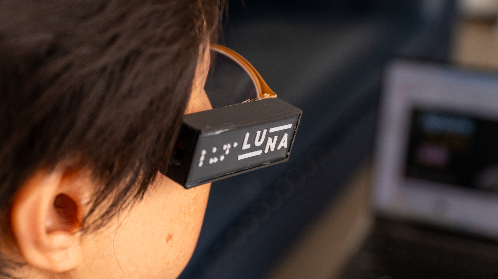

# LUNA ESP32‑S3 Firmware

Firmware for the LUNA wearable device, running on an ESP32‑S3, that captures images and streams them to a cloud API. It exposes a BLE control interface for provisioning and file transfer, runs camera & audio drivers, and handles HTTP & WebSocket communication.

  

---

## 🚀 Features

- **BLE Provisioning**:  
    - JSON‑based “networkconnect” control (`ssid`/`pwd`)  
    - File‑transfer (“filetransfer” chunks) for large payloads  
- **Wi‑Fi Management**:  
    - Connect/disconnect, store credentials in NVS  
- **Camera Capture**:  
    - JPEG snapshots via ESP‑CAM driver in PSRAM  
- **Audio I/O** *(optional)*:  
    - PDM microphone input + I2S speaker output  
- **Cloud Delivery**:  
    - **HTTP POST** `/describe-stream` (image/jpeg + auth)  
    - **WebSockets** live duplex: send image/audio frames, receive audio response  
- **FreeRTOS Tasks**:  
    - BLE callbacks only enqueue work  
    - Dedicated “NetworkHandlerTask” does JSON parsing & Wi‑Fi actions  
    - Dedicated “WebSocketLoop” for live streaming  

---

## 🔧 Hardware & Wiring

- **Board**: ESP32‑S3 with PSRAM  
- **Camera**: OV5640 (or compatible) wired to GPIOs:  
    - D0→Y2, D1→Y3, … D7→Y9  
    - XCLK→XCLK, PCLK→PCLK, VSYNC→VSYNC, HREF→HREF  
    - SCCB SDA→SIOD, SCL→SIOC  
- **Power**: 3.3 V regulated (camera + ESP32)  
- **Audio**:  
    - PDM mic → I2S_IN pins  
    - I2S speaker → I2S_OUT pins  

Refer to `camera.h` and `audio.h` for exact pin definitions.

---

## 🏗️ Firmware Architecture

    src/
    ├── main.cpp              # setup(), loop()
    ├── bluetooth.cpp/.h      # BLEConnector (callbacks + queue)
    ├── camera.cpp/.h         # Camera setup & snapshot
    ├── audio.cpp/.h          # Audio::AudioIO class
    ├── api.cpp/.h            # APIClient & LiveClient
    └── bluetooth.h           # common includes & Payload struct

---

## 🤝 BLE Interface

| Characteristic UUID     | Props        | Payload Type        |
|-------------------------|--------------|---------------------|
| CREDENTIALS_UUID        | WRITE+NOTIFY | Base64 JSON command |
| CONTROL_UUID            | WRITE+NOTIFY | Provision JSON      |
| DATA_UUID               | WRITE+NOTIFY | Raw file bytes      |
| STATUS_UUID *(opt.)*    | NOTIFY       | WIFI:OK/WIFI:ERR    |

**networkconnect**  
    { "type":"networkconnect", "ssid":"YourSSID", "pwd":"YourPassword" }

**filetransfer**  
- Start:  
      { "type":"filetransfer", "cmd":"start", "size":12345 }  
- Data: raw bytes via DATA_UUID

---

